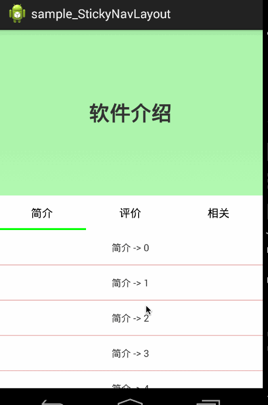

# Android-StickyNavLayout
An android library for navigator that stick on the top and top springback


# 效果图




# 用法
直接作为跟布局，内部一次放置，顶部内容区域，导航，ViewPager。
注意id，需要使用预定的id资源。已修改为id不需要预定

```xml
<com.lixh.stickynavlibrary.StickyNavLayout xmlns:android="http://schemas.android.com/apk/res/android"
    android:layout_width="match_parent"
    android:layout_height="match_parent"
    android:orientation="vertical">

    <RelativeLayout
        android:id="@+id/id_topview"
        android:layout_width="match_parent"
        android:layout_height="wrap_content"
        android:background="#4400ff00">

        <TextView
            android:layout_width="match_parent"
            android:layout_height="256dp"
            android:layout_marginTop="100dp"
            android:gravity="center"
            android:text="软件介绍"
            android:textSize="30sp"
            android:textStyle="bold" />
    </RelativeLayout>


    <com.lixh.stickynavlibrary.SimpleViewPagerIndicator
        android:id="@+id/id_indicator"
        android:layout_width="match_parent"
        android:layout_height="50dp"
        android:background="#ffffffff"></com.lixh.stickynavlibrary.SimpleViewPagerIndicator>

    <android.support.v4.view.ViewPager
        android:id="@+id/id_viewpager"
        android:layout_width="match_parent"
        android:layout_height="match_parent"></android.support.v4.view.ViewPager>

</com.lixh.stickynavlibrary.StickyNavLayout>
```

